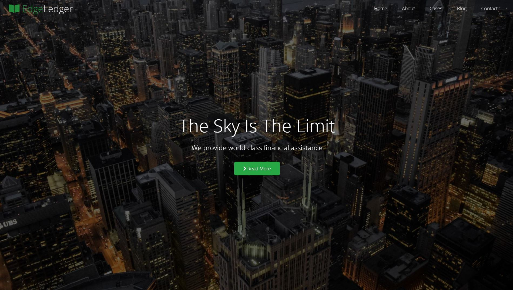
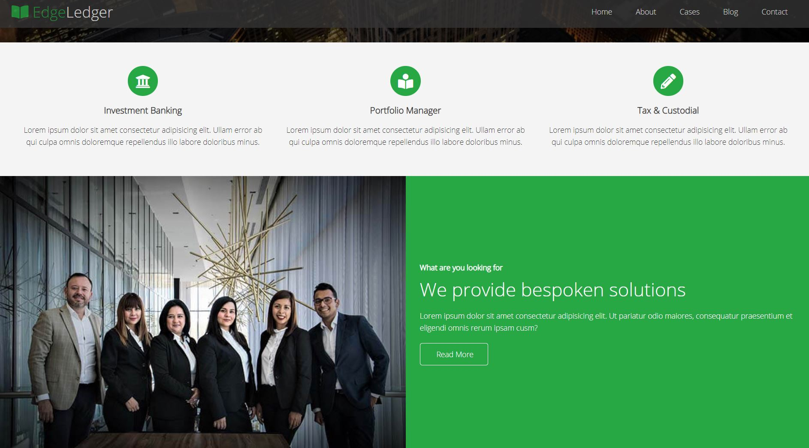
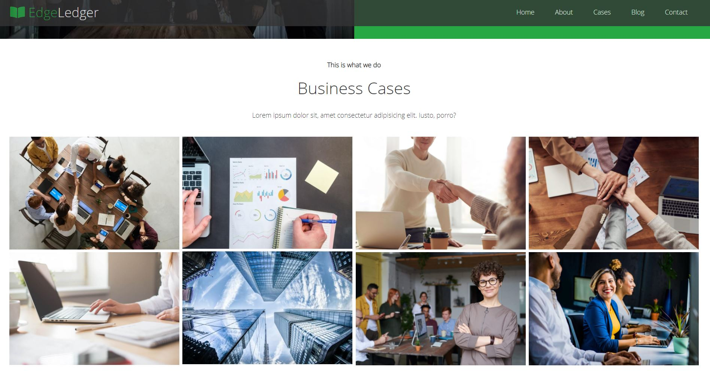
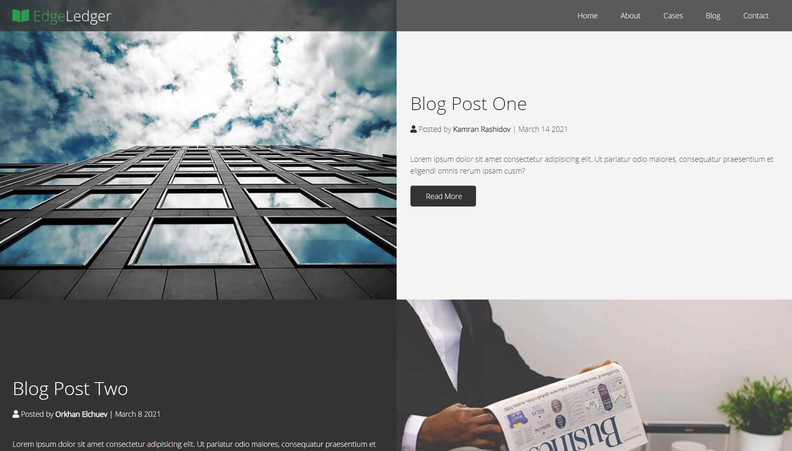

# Website-Flexbox
#### Creating a responsive Flexbox Website called EdgeLedger with Home, About, Cases, Blog(section/ page), Blogs(page), Contact sections. This website is created using HTML, CSS styling and JavaScript via [Brad Traversy](https://www.udemy.com/course/modern-html-css-from-the-beginning/)'s Udemy course.

## Screenshots 

### Home Section 

### About Section 

### Cases Section 

### Blog Page

### Contact and Footer Sections 

## Tools used while developing this project
- Visual Studio Code
- HTML
- CSS
- JavaScript
- Gitbash

## Acknowledgements
- [fontawesome](https://fontawesome.com/)

## Contacts 
- E-mail address orkhan.elchuev@gmail.com
